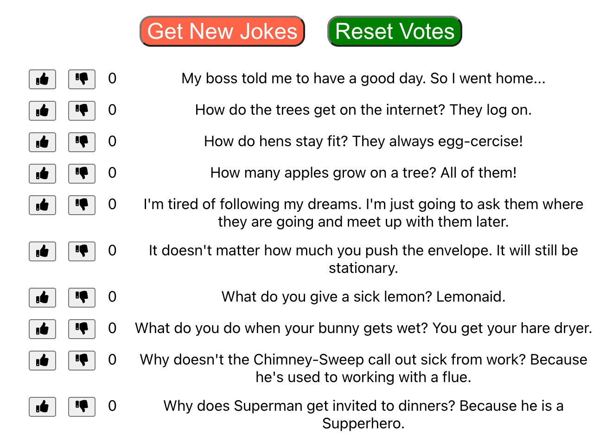

# CheeZJokes App
An app that lets people view and vote on cheesy jokes. To generate jokes, it uses the ICanHazDadJoke API.

When the page loads, the application fetches 10 jokes, making sure that no joke appears more than once on the page.

The application lists the jokes, along with a “vote-up” button, a “vote-down” button, and the net score (up - down) for each joke. Users can vote, and the net score updates.

The application is written using class components. 

